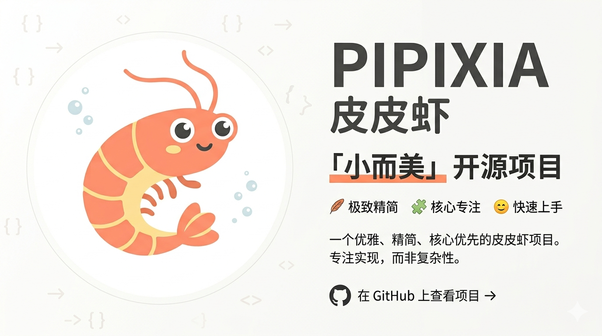

# <div align="left" style="display: flex; align-items: center; line-height: 1.2; gap: 8px;">   <span style="font-size: 32px; font-weight: bold;">PiPiClaw - Intelligent Agent</span> </div>

<div align="center">


**Let AI be your all-round copilot — natively connected to 10,000+ Skill-Hub ecosystem skills**

**🌐 Language | 语言切换:** [English](README_EN.md) | [中文](README.md)

</div>

> 🏆 **Packed binary ~2 MB** — likely the tiniest local AI agent around; single-file publish with instant startup, pocket-friendly to carry everywhere.

---

## 📖 Project Introduction

**PiPiClaw** is a personal AI copilot that runs on your own device. It follows the OpenAI API specification: the default example uses Qwen, but you can plug in any OpenAI-compatible LLM (OpenAI/Azure OpenAI, Qwen/DashScope, DeepSeek, Moonshot, SiliconFlow, Together AI, etc.). It stays lightweight and always-on, pairing the terminal with a built-in Web console to render the commands and task board you control across Windows, macOS, and Linux. The gateway is merely the management surface—the real assistant lives locally beside you.

- Beyond DevOps: a full-spectrum local agent that can orchestrate development, automation, data handling, knowledge search, and more.
- Native Skill-Hub integration lets you search and install 10,000+ ecosystem skills with one click to expand capabilities without limits.

> Recommended setup: run `dotnet run` directly in the terminal and follow the first-run guide to set your API Key, model, and the Web console (any OpenAI-compatible provider works). You can also publish a self-contained AOT build (`dotnet publish -c Release -r win-x64|osx-x64|linux-x64 --self-contained true`) and run it instantly on macOS, Linux, or Windows (including WSL2). New installations can start with the “Quick Start” section below.

<div align="center">
  
</div>

## 🖥️ Interface Preview

<div align="center">
  
  
</div>

<div align="center">
  
</div>

> The desktop settings page lets you add any OpenAI-compatible model & endpoint, making it easy to switch among Qwen, DeepSeek, Moonshot, OpenAI/Azure, and more.

---

## ✨ Core Features

| Feature | Description |
|------|------|
| 🔧 **Command Execution** | Cross-platform terminal command execution (ls, git, npm, docker, systemctl, etc.) |
| 📄 **File Reading** | Intelligently reads text, code, and configuration files with auto encoding detection (UTF-8/GBK) |
| ✍️ **File Writing** | Automatically generates code and config files, supports partial modifications |
| 🖼️ **Image Analysis** | Supports recognition and analysis of local screenshots and photos (Base64) |
| 🔍 **Content Search** | Search for files containing specific keywords in specified directories (function names, variables, classes, etc.) |
| ⏰ **Scheduled Tasks** | Supports one-time/periodic task scheduling with persistent storage and auto-execution |
| 🧩 **Skill Extensions** | Search and install extension skills from Skill-Hub to infinitely expand capabilities |
| 🌐 **Web Console** | Built-in lightweight Web UI (port 5050) for remote browser control |
| 🧠 **Memory Management** | Multi-turn conversation context memory, auto-cleanup after task completion to save tokens |
| 🔐 **Permission Handling** | Smart sudo privilege interception with automatic password handling (non-Windows) |

---

## 🚀 Quick Start

### Prerequisites

- [.NET 10.0 SDK](https://dotnet.microsoft.com/download) or higher
- Any **OpenAI-compatible** API Key (examples: OpenAI/Azure OpenAI, Alibaba Cloud DashScope, DeepSeek, Moonshot, SiliconFlow, Together AI, etc.)

### Installation & Running

```bash
# Clone the project
git clone https://github.com/anan1213095357/PiPiClaw.git
cd PiPiClaw

# Restore dependencies
dotnet restore

# Run the project
dotnet run
```

On first run, `appsettings.json` will be automatically generated. Follow the prompts to enter your API Key.

### Publish as Standalone Executable

```bash
# Publish AOT compiled version (single file, high performance)
dotnet publish -c Release -r win-x64 --self-contained true
dotnet publish -c Release -r osx-x64 --self-contained true
dotnet publish -c Release -r linux-x64 --self-contained true
```

---

## ⚙️ Configuration

### Configuration File (appsettings.json)

> Generated on first run. The `Models` list supports adding multiple providers and switching from the Web UI dropdown.

```json
{
  "Models": [
    {
      "ApiKey": "sk-your-actual-api-key-here",
      "Model": "qwen3.5-plus",
      "Endpoint": "https://dashscope.aliyuncs.com/compatible-mode/v1/chat/completions"
    }
  ],
  "SudoPassword": "",
  "WebPort": 5050
}
```

| Config | Description |
|--------|-------------|
| `Models` | Model list; the first entry is default and can be switched live in the Web UI |
| `Models[].ApiKey` | Any OpenAI/compatible API Key (DashScope shown as an example) |
| `Models[].Model` | AI model to use (default example: qwen3.5-plus; fill in DeepSeek/Moonshot/GPT, etc.) |
| `Models[].Endpoint` | OpenAI-spec-compatible API endpoint URL |
| `SudoPassword` | (Optional) Auto-privilege password for Linux/macOS |
| `WebPort` | Web console port (default 5050) |

### Environment Variables

```bash
# macOS / Linux
export ApiKey="sk-your-api-key-here"
export Model="qwen3.5-plus"
export Endpoint="https://dashscope.aliyuncs.com/compatible-mode/v1/chat/completions"
export WebPort=5050
export SudoPassword=""

# Windows PowerShell
$env:ApiKey="sk-your-api-key-here"
$env:Model="qwen3.5-plus"
$env:Endpoint="https://dashscope.aliyuncs.com/compatible-mode/v1/chat/completions"
$env:WebPort="5050"
$env:SudoPassword=""
```

> Environment variable names match the config keys (case-sensitive), handy for containers or temporary overrides.

> The snippet above uses DashScope as an example. Replace `Model` and `Endpoint` with those from the OpenAI-compatible service you use (OpenAI/Azure, DeepSeek, Moonshot, etc.).

---

## 💡 Usage Examples

After starting PiPiClaw, you can input various natural language instructions:

### Basic Operations
```
> Help me scan the current directory for C# source files

> Read the contents of package.json and analyze dependencies

> Execute git status to check the current repository state

> Check the current memory usage of the system and write the result to memory_log.txt
```

### File Operations
```
> Create a configuration file named config.json containing database connection information

> Replace all Console.WriteLine with Debug.WriteLine in main.cs
```

### Scheduled Tasks
```
> Take a screenshot every day at 3 PM to see what I'm doing

> Check CPU usage every 30 minutes and log it if it exceeds 80%
```

### Skill Extensions
```
> Search for weather-related skills

> Install the calendar skill
```

---

## 🏗️ Project Structure

```
PiPiClaw/
├── Program.cs                # Main program entry (all logic)
├── PiPiClaw.csproj           # Project configuration file
├── README.md                 # Project documentation (Chinese)
├── README_EN.md              # Project documentation (English)
├── .gitignore                # Git ignore rules
├── appsettings.json          # Configuration file (local use, do not commit)
├── appsettings.example.json  # Configuration template (can be committed)
├── Properties/               # Project property configuration
├── bin/                      # Build output directory
├── obj/                      # Temporary build files
├── logs/                     # Logs directory
├── skills/                   # Extension skills directory (auto-created)
├── pi_history.json           # Conversation memory archive
└── pi_scheduled_tasks.json   # Scheduled tasks archive
```

---

## 🔬 Technology Stack

| Component | Technology |
|-----------|------------|
| **Runtime** | .NET 10.0 |
| **Compilation** | AOT (Ahead-of-Time) Compilation |
| **AI Model** | OpenAI-spec-compatible LLMs (examples: Qwen, DeepSeek, Moonshot, OpenAI/Azure, etc.) |
| **HTTP Client** | System.Net.Http |
| **JSON Processing** | System.Text.Json |
| **Encoding** | UTF-8 / GBK Auto-detection |

### Project Features

- ✅ **AOT Compilation** - Smaller size, faster startup speed
- ✅ **Ultra-lightweight** - Published package is only ~2 MB; single-file, instant start anywhere
- ✅ **Cross-Platform** - Supports Windows, Linux, macOS
- ✅ **Streaming Conversation** - Supports multi-turn contextual dialogue
- ✅ **Tool Calling** - 10+ built-in tools with intelligent scheduling
- ✅ **Task Scheduling** - Persistent task queue with automatic loop execution
- ✅ **Web UI** - Built-in HTTP server for browser remote control
- ✅ **Skill System** - Online search and installation of extension skills
- ✅ **Error Handling** - Comprehensive exception capture and prompts
- ✅ **Secure Configuration** - API Key separated from code, supports environment variables
- ✅ **Log Compression** - Auto-fold similar log lines to save tokens

---

## 🌐 Web Console

PiPiClaw includes a built-in lightweight Web UI, automatically listening on `http://localhost:5050`

**Features:**
- 📱 Responsive design, supports mobile/tablet access
- 🎨 Cyberpunk style interface
- 📡 Real-time streaming output of tool calls
- ⏰ Visual scheduled task viewing
- 🔧 Online multi-model configuration / switching (API Key + dropdown)
- 📷 QR code in bottom-left corner for quick mobile connection

---

## 📝 Notes

1. **API Key Security**: `appsettings.json` has been added to `.gitignore`, do not manually commit files containing real Keys
2. **Command Execution Permissions**: Commands executed by the tool have the same permissions as the current user, please operate with caution
3. **Network Dependency**: Stable network connection is required to call AI services
4. **Token Limit**: Large file reading will be automatically truncated to prevent Token overflow
5. **File Modification**: When modifying existing files, please ensure to provide precise old_content for replacement
6. **Windows Privilege**: Windows environment cannot automatically handle sudo, please run the program as Administrator

---

## 🤝 Contribution Guidelines

Issues and Pull Requests are welcome!

1. Fork this project
2. Create a feature branch (`git checkout -b feature/AmazingFeature`)
3. Commit changes (`git commit -m 'Add some AmazingFeature'`)
4. Push to branch (`git push origin feature/AmazingFeature`)
5. Open a Pull Request

---

## 📄 License

This project is open source under the [MIT License](LICENSE).

---

<div align="center">

 Made with ❤️ by 奶茶叔叔

If this project helps you, please give it a ⭐ Star to show your support!

</div>
